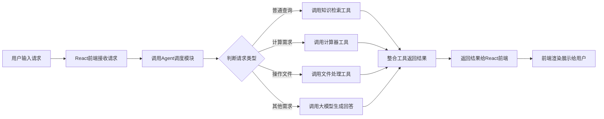

# React Agent 实现流程
## 流程图

## 步骤说明
1. **请求接收阶段**：用户在React前端界面输入查询内容，提交请求到前端状态管理模块
2. **Agent调度阶段**：前端调用内置的Agent调度器，对用户请求进行意图识别和任务拆解
3. **工具调用阶段**：根据拆解后的任务类型，匹配对应的工具执行：
   - 知识类查询调用向量知识库检索相关内容
   - 数学计算类请求调用计算器工具执行运算
   - 文件操作类请求调用读写文件、目录查询等工具
   - 开放式问题直接调用大语言模型生成回答
4. **结果整合阶段**：Agent调度器收集所有工具返回的结果，进行内容整合和格式优化
5. **结果返回阶段**：整合后的结果返回给React前端组件，经过样式处理后渲染展示给用户
6. **迭代优化（可选）**：用户如果对结果不满意，可以输入补充要求，Agent重新执行上述流程生成更符合需求的结果
