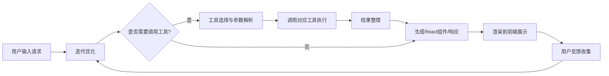

# React Agent 执行流程
## 流程图

## 详细步骤说明
### 1. 用户请求接收
- 接收用户在前端界面输入的自然语言请求，比如「生成一个登录表单」「展示商品列表页面」等
- 对用户输入进行预处理：去除特殊字符、补全上下文信息、关联历史会话记录
### 2. 意图识别
- 基于大语言模型解析用户核心需求，识别请求类型：
  - 组件生成需求：基础UI组件、业务组件、页面模板
  - 数据查询需求：接口调用、数据统计、信息检索
  - 功能操作需求：组件修改、样式调整、逻辑优化
- 提取需求关键词：组件类型、样式要求、交互逻辑、数据来源等
### 3. 工具调用判断
- 根据识别的意图判断是否需要调用外部工具：
  - 需要调用工具：数据查询、文件读写、API调用、第三方服务集成等场景
  - 无需调用工具：纯静态组件生成、样式调整、逻辑编写等可直接生成代码的场景
### 4. 工具选择与执行
- 匹配对应工具：根据需求选择计算器、天气查询、文件读写、接口请求等对应工具
- 参数解析：从用户请求中提取工具所需的必填参数，参数缺失时发起追问补全
- 执行工具调用：传入正确参数调用工具，捕获执行异常并进行重试/报错处理
### 5. 结果整理与代码生成
- 整合工具返回结果与用户原始需求
- 生成符合规范的React代码：
  - 使用React 18 + Hooks 语法
  - 支持TypeScript类型定义
  - 集成Tailwind CSS/Styled Components样式
  - 内置交互逻辑和事件处理
  - 自动适配响应式布局
### 6. 前端渲染与用户反馈
- 生成的代码自动在前端预览区实时渲染，支持热更新
- 收集用户使用反馈：是否符合需求、存在的问题、调整要求
- 将反馈重新传入意图识别模块，进入下一轮迭代优化，直到满足用户需求
## 常见场景示例
| 场景 | 执行流程 |
|------|----------|
| 生成带天气信息的首页 | 用户请求→意图识别→调用天气工具→整合天气数据→生成带天气模块的React首页→渲染展示 |
| 生成带计算功能的计算器组件 | 用户请求→意图识别→无需调用工具→直接生成计算器React组件→内置计算器工具调用逻辑→渲染展示 |
| 生成读取本地文件的管理后台 | 用户请求→意图识别→调用文件读取工具→读取指定文件内容→生成展示文件内容的React后台页面→渲染展示 |