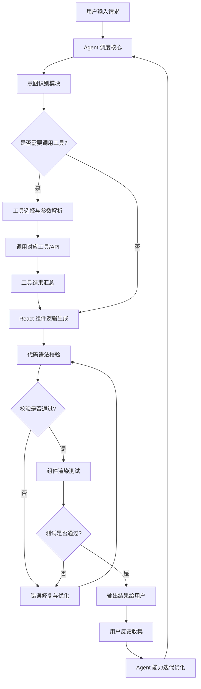

# React Agent 运行流程说明

## 整体流程图

## 详细步骤说明
### 1. 用户交互阶段
- 用户通过界面输入React开发相关需求（比如：生成带搜索功能的用户列表组件、实现带验证逻辑的登录表单等）
- Agent 接收用户自然语言指令，完成上下文初始化，关联历史对话信息

### 2. 意图理解与决策阶段
- 意图识别模块分析需求核心目标，提取关键约束：技术栈要求（函数组件/Hooks/TypeScript等）、样式规范（Tailwind/Styled Components等）、交互逻辑要求
- 决策模块判断是否需要调用外部工具：比如需要查询组件库文档、需要获取现有项目代码片段、需要调用业务API获取数据等场景触发工具调用流程

### 3. 工具调用阶段（可选）
- 根据需求类型匹配对应工具：代码查询工具、UI组件库文档工具、业务数据接口、计算器工具、笔记工具等
- 自动解析工具调用所需参数，完成工具调用，汇总工具返回的结果数据，作为后续组件生成的输入数据源

### 4. React 组件生成阶段
- 结合用户需求和工具返回结果，生成符合规范的React组件代码
- 自动实现核心逻辑：状态管理、事件绑定、数据渲染、交互效果、生命周期处理、错误边界处理等
- 自动生成配套内容：TypeScript类型定义、样式代码、使用注释说明、依赖安装提示

### 5. 校验与测试阶段
- 语法校验：自动检查生成代码的ES语法错误、TypeScript类型错误、React Hooks规则合规性
- 渲染测试：模拟组件渲染场景，检查是否存在渲染异常、props传递错误、状态更新异常等问题
- 功能校验：验证组件功能是否匹配用户需求，交互逻辑是否符合预期
- 若校验/测试不通过，自动进入错误修复流程，基于错误信息重新生成优化后的代码

### 6. 输出与迭代阶段
- 将最终校验通过的组件代码、效果预览说明、使用指南输出给用户
- 收集用户反馈意见：功能不符合预期、样式需要调整、性能优化需求等
- 反馈数据用于Agent模型微调优化，持续提升后续需求处理的准确率和效率

## 常见场景示例
用户需求：`生成一个带分页的商品列表组件，调用https://api.example.com/products接口获取数据，用Tailwind写样式`
对应流程：
1. 识别需求为React列表组件开发，提取接口地址、分页、Tailwind样式三个核心参数
2. 判断无需调用额外工具，直接进入组件生成阶段
3. 生成代码：包含useState管理分页参数、useEffect调用接口、列表渲染、分页按钮交互逻辑
4. 校验代码语法、模拟渲染测试，确认无错误
5. 输出最终可直接运行的组件代码和使用说明