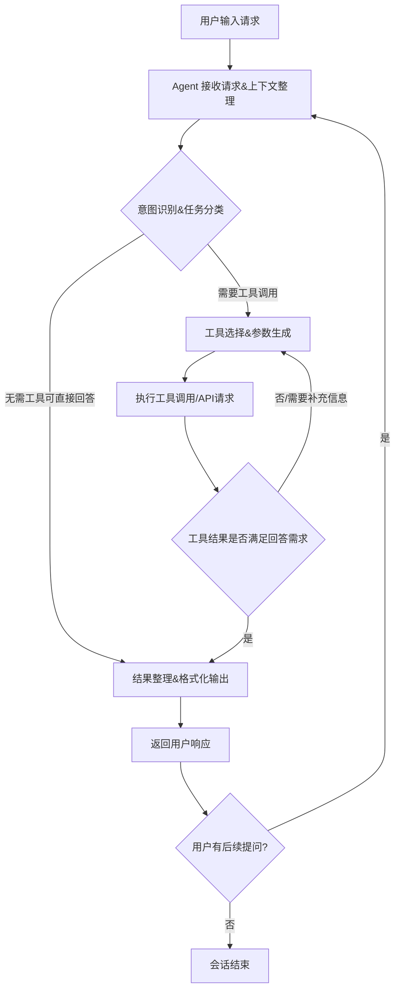

# React Agent 工作流程

## 流程图

## 详细步骤说明
1. **请求接收与上下文整理**
   - Agent 接收用户输入的查询内容，同时关联当前会话的历史上下文信息，保证理解任务的完整性
   - 过滤无关信息，提取核心诉求

2. **意图识别与任务分类**
   - 对用户请求进行语义分析，识别核心意图
   - 判断任务类型：是通用知识类可以直接回答，还是需要调用外部工具（比如查询天气、读取文件、计算等）才能完成
   - 拆分复杂任务为多个子任务节点

3. **工具选择与参数生成**
   - 根据任务需求匹配最合适的可用工具，确认工具调用的必填参数
   - 从用户请求和上下文中提取参数值，生成合法的工具调用请求
   - 多轮工具调用场景下，整合前序工具返回的结果作为后续调用的参数

4. **工具执行**
   - 调用对应工具/外部API，执行操作
   - 捕获工具执行异常，处理超时、参数错误等问题，必要时重试或提示用户补充信息

5. **结果校验**
   - 对工具返回的结果进行校验，判断是否已经能够完整回答用户的初始诉求
   - 如果信息不足/需要多步操作，回到工具选择步骤继续执行后续调用

6. **结果整理输出**
   - 整合所有工具返回结果/直接生成的回答内容，按照用户可理解的格式进行结构化输出
   - 针对复杂任务附操作说明或者结果解释

7. **会话后续处理**
   - 接收用户后续提问，回到上下文整理步骤开启新一轮处理
   - 无后续交互则标记当前会话结束
