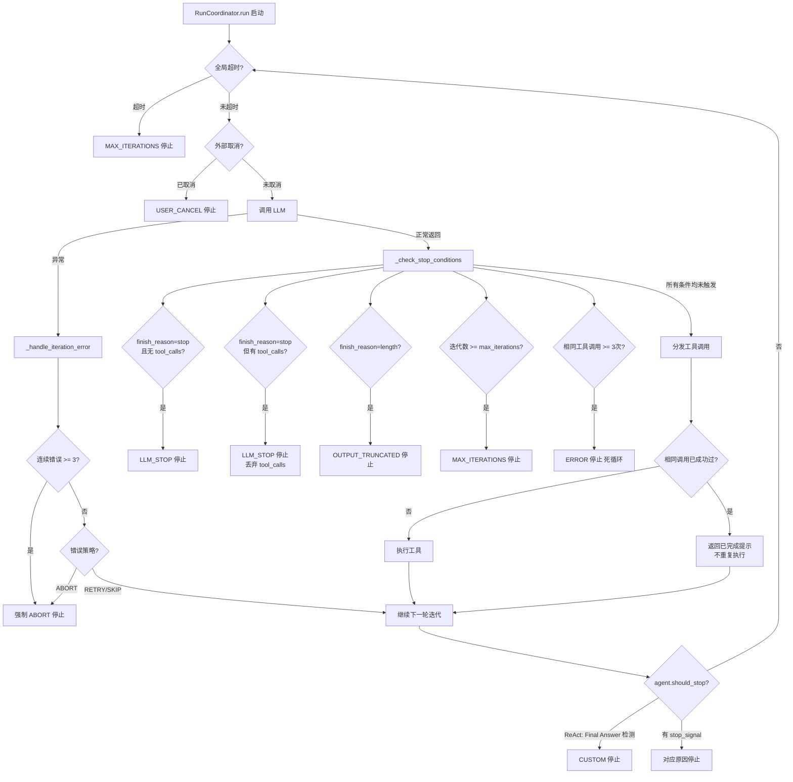

# Agent 终止条件全景图

## 一、终止流程总览



## 二、StopReason 枚举（6 种）

| StopReason | 含义 | 触发位置 | 适用范围 |
|-----------|------|---------|---------|
| `LLM_STOP` | 模型正常完成输出 | `loop.py: _check_stop_conditions` | 主/子 Agent |
| `MAX_ITERATIONS` | 迭代次数或超时达上限 | `loop.py` / `coordinator.py` | 主/子 Agent |
| `OUTPUT_TRUNCATED` | 模型输出被截断 | `loop.py: _check_stop_conditions` | 主/子 Agent |
| `ERROR` | 不可恢复错误/死循环检测 | `loop.py: _handle_iteration_error` | 主/子 Agent |
| `CUSTOM` | ReAct Agent 检测到 "Final Answer:" | `react_agent.py: should_stop` | 仅 ReAct |
| `USER_CANCEL` | 外部 asyncio.Event 取消 | `coordinator.py: run` | 主/子 Agent |

## 三、终止条件详细说明

### 3.1 正常完成

#### LLM_STOP — 模型主动停止
```
位置: loop.py: _check_stop_conditions()
条件: finish_reason == "stop" AND tool_calls 为空
日志: stop_check.llm_stop (debug)
```

模型返回 `finish_reason="stop"` 且没有工具调用，表示模型认为任务已完成。

#### LLM_STOP — stop + tool_calls 边界处理
```
位置: loop.py: _check_stop_conditions()
条件: finish_reason == "stop" AND tool_calls 非空
处理: 优先信任 stop 信号，丢弃 tool_calls
日志: stop_check.stop_with_tool_calls (warning)
```

部分国产模型（如豆包/通义）会在 `finish_reason="stop"` 时仍携带 tool_calls。框架优先终止，避免循环。

#### CUSTOM — ReAct "Final Answer:" 检测
```
位置: react_agent.py: should_stop()
条件: 模型输出匹配正则 r"Final\s*Answer\s*[:：]\s*(.*)"
日志: 无专用日志（coordinator 记录 run.finished）
```

ReAct Agent 使用文本模式匹配检测终止，同时支持英文冒号 `:` 和中文冒号 `：`。

### 3.2 迭代/时间限制

#### MAX_ITERATIONS — 迭代次数上限
```
位置: loop.py: _check_stop_conditions() + base_agent.py: should_stop()
条件: iteration_count + 1 >= max_iterations（双重检查）
默认值:
  主 Agent: 20 次（AgentConfig.max_iterations）
  子 Agent: 10 次（SubAgentSpec.max_iterations）
日志: stop_check.max_iterations_reached (warning)
```

双重检查保证无 off-by-one 漏洞：
1. `_check_stop_conditions` 在迭代执行**前**检查 `iteration_count + 1 >= max_iterations`
2. `should_stop` 在迭代执行**后**检查 `iteration_count >= max_iterations`

#### 全局墙钟超时
```
位置: coordinator.py: run() while 循环开头
条件: elapsed_ms >= run_timeout_ms
默认值:
  主 Agent: 300,000 ms（5 分钟）
  子 Agent: 继承主 Agent 超时
StopReason: MAX_ITERATIONS（语义复用）
日志: run.timeout (warning)
```

防止单次迭代耗时极长（模型响应慢）导致主 Agent 无限挂起。

#### 子 Agent 调度器超时
```
位置: scheduler.py: submit() 内部 _wrapped()
条件: asyncio.wait_for 超过 deadline_ms
默认值: 60,000 ms（60 秒）
结果: SubAgentResult(success=False, error="Sub-agent timed out...")
日志: scheduler.task_timeout (error)
```

独立于迭代计数，按墙钟时间强制终止子 Agent。

### 3.3 安全防护

#### 重复工具调用检测（死循环保护）
```
位置: loop.py: _check_stop_conditions() → _detect_repeated_tool_calls()
条件: 连续 _MAX_REPEATED_TOOL_CALLS (3) 次相同工具 + 相同参数
判定方式: JSON 序列化参数后比对签名
StopReason: ERROR
日志:
  - loop.repeated_tool_calls_detected (warning, count >= 2)
  - stop_check.stuck_loop_detected (warning, count >= 3)
```

签名计算方式：
```python
# 对工具名排序 + 参数 JSON 序列化
f"{function_name}({json.dumps(arguments, sort_keys=True)})"
```

#### 去重拦截（已成功工具不重复执行）
```
位置: loop.py: _dispatch_tool_calls()
条件: 当前工具调用签名在历史成功集合中存在
处理: 不执行工具，返回提示 "Already succeeded. Do NOT call again."
日志: tool.duplicate_blocked (warning)
```

与重复检测的区别：
- **去重拦截**：预防性，第 2 次调用就拦截，返回提示但不终止 run
- **重复检测**：终止性，第 3 次调用直接终止 run

#### 连续错误强制 ABORT
```
位置: loop.py: _handle_iteration_error()
条件: 连续 _MAX_CONSECUTIVE_ERRORS (3) 次 LLM 异常，且策略非 ABORT
处理: 覆盖原策略为 ABORT
StopReason: ERROR
日志: llm.error.forced_abort (warning)
```

防止 `ErrorStrategy.RETRY` 策略下的无限重试循环。

#### OUTPUT_TRUNCATED — 输出被截断
```
位置: loop.py: _check_stop_conditions()
条件: finish_reason == "length"
StopReason: OUTPUT_TRUNCATED
日志: stop_check.output_truncated (warning)
```

### 3.4 外部控制

#### USER_CANCEL — 外部取消
```
位置: coordinator.py: run() while 循环开头
条件: cancel_event.is_set()（asyncio.Event）
StopReason: USER_CANCEL
日志: run.cancelled (info)

使用方式:
  cancel = asyncio.Event()
  task = asyncio.create_task(coordinator.run(..., cancel_event=cancel))
  cancel.set()  # 触发取消
```

#### 子 Agent 配额限制
```
位置: scheduler.py: _enforce_quota()
条件: parent_run_id 下已派生数 >= max_per_run
默认值: max_per_run = 5
处理: 抛出 RuntimeError，不创建子 Agent
日志: scheduler.quota_exceeded (warning)
```

#### 子 Agent 递归防护
```
位置: delegation.py: delegate_to_subagent()
条件: parent_agent.agent_config.allow_spawn_children == False
处理: 返回 SubAgentResult(success=False, error="PERMISSION_DENIED")
日志: delegation.subagent.spawn_denied (warning)

强制机制: SubAgentFactory 创建子 Agent 时硬编码 allow_spawn_children=False
```

## 四、主/子 Agent 终止条件对比

| 终止条件 | 主 Agent | 子 Agent |
|---------|---------|---------|
| max_iterations 默认值 | **20** | **10** |
| 全局超时 (run_timeout_ms) | **300s (5分钟)** | 继承（但受调度器 deadline 约束） |
| 调度器超时 (deadline_ms) | 无 | **60s** |
| 重复工具调用检测 | 3 次 | 3 次（相同） |
| 连续错误强制 ABORT | 3 次 | 3 次（相同） |
| 去重拦截 | 有 | 有（相同） |
| 外部取消 (cancel_event) | 有 | 有（相同） |
| allow_spawn_children | 可配 True | **强制 False** |
| 配额限制 | 无 | 5 个/run |
| 并发限制 | 无 | 3 个同时 |

## 五、终止判定执行顺序

每次迭代中，终止检查按以下顺序执行：

```
1. [Coordinator] 全局超时检查        → run.timeout
2. [Coordinator] 外部取消检查        → run.cancelled
3. [Loop]        调用 LLM
4. [Loop]        错误处理（若异常）   → llm.error / llm.error.forced_abort
5. [Loop]        _check_stop_conditions:
   5a. finish_reason="stop" 无 TC   → LLM_STOP
   5b. finish_reason="stop" 有 TC   → LLM_STOP (丢弃 TC)
   5c. finish_reason="length"       → OUTPUT_TRUNCATED
   5d. iteration >= max_iterations   → MAX_ITERATIONS
   5e. 重复工具调用 >= 3             → ERROR (stuck loop)
6. [Loop]        工具分发（含去重拦截）
7. [Coordinator] agent.should_stop:
   7a. stop_signal 存在              → 终止
   7b. iteration >= max_iterations   → 终止
   7c. [ReAct] "Final Answer:" 匹配 → CUSTOM 终止
8. [Coordinator] 回到步骤 1
```

## 六、关键安全常量

| 常量 | 值 | 定义位置 | 说明 |
|------|---|---------|------|
| `_MAX_REPEATED_TOOL_CALLS` | 3 | `loop.py:28` | 相同工具调用重复次数上限 |
| `_MAX_CONSECUTIVE_ERRORS` | 3 | `loop.py:30` | 连续 LLM 错误上限 |
| `DEFAULT_RUN_TIMEOUT_MS` | 300,000 | `coordinator.py:26` | 全局运行超时（5分钟） |
| `AgentConfig.max_iterations` | 20 | `models/agent.py:83` | 主 Agent 默认迭代上限 |
| `SubAgentSpec.max_iterations` | 10 | `models/subagent.py:35` | 子 Agent 默认迭代上限 |
| `SubAgentSpec.deadline_ms` | 60,000 | `models/subagent.py:36` | 子 Agent 调度器超时（60秒）|
| `max_per_run` | 5 | `config.py:46` | 每次 run 最多派生子 Agent 数 |
| `max_concurrent` | 3 | `config.py:47` | 子 Agent 最大并发数 |

## 七、日志事件速查

### 终止相关日志

| 事件 | 级别 | 含义 |
|------|------|------|
| `stop_check.llm_stop` | DEBUG | 模型正常停止 |
| `stop_check.stop_with_tool_calls` | WARNING | stop + tool_calls 边界处理 |
| `stop_check.output_truncated` | WARNING | 输出被截断 |
| `stop_check.max_iterations_reached` | WARNING | 迭代上限 |
| `stop_check.stuck_loop_detected` | WARNING | 死循环检测触发 |
| `loop.repeated_tool_calls_detected` | WARNING | 重复调用预警（count >= 2） |
| `tool.duplicate_blocked` | WARNING | 去重拦截 |
| `llm.error` | ERROR | LLM 调用异常 |
| `llm.error.forced_abort` | WARNING | 连续错误强制终止 |
| `llm.error.continuing` | INFO | 错误后继续（RETRY/SKIP） |
| `run.timeout` | WARNING | 全局超时 |
| `run.cancelled` | INFO | 外部取消 |
| `run.finished` | INFO | 正常结束（含 stop_reason） |
| `run.failed` | ERROR | 异常结束 |
| `scheduler.task_timeout` | ERROR | 子 Agent 超时 |
| `scheduler.task_cancelled` | WARNING | 子 Agent 被取消 |
| `scheduler.quota_exceeded` | WARNING | 子 Agent 配额超限 |
| `delegation.subagent.spawn_denied` | WARNING | 递归派生被阻止 |
